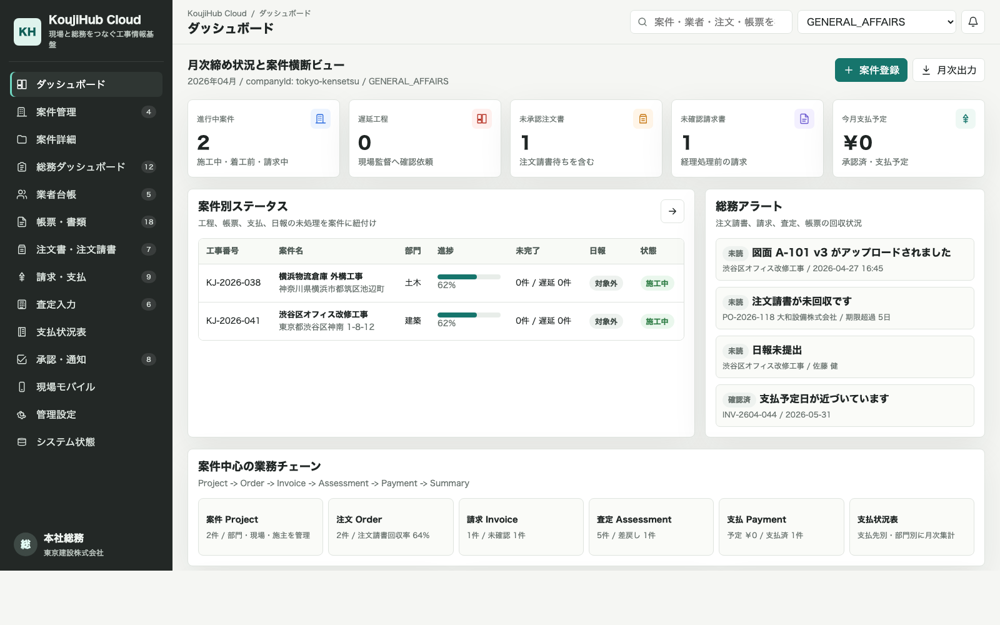
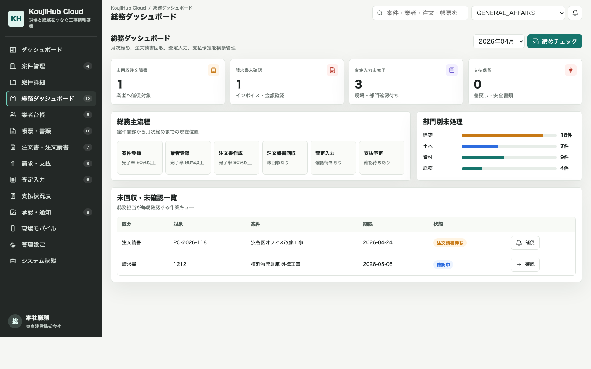
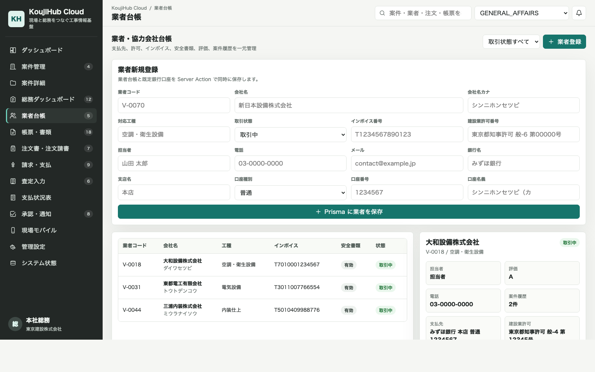
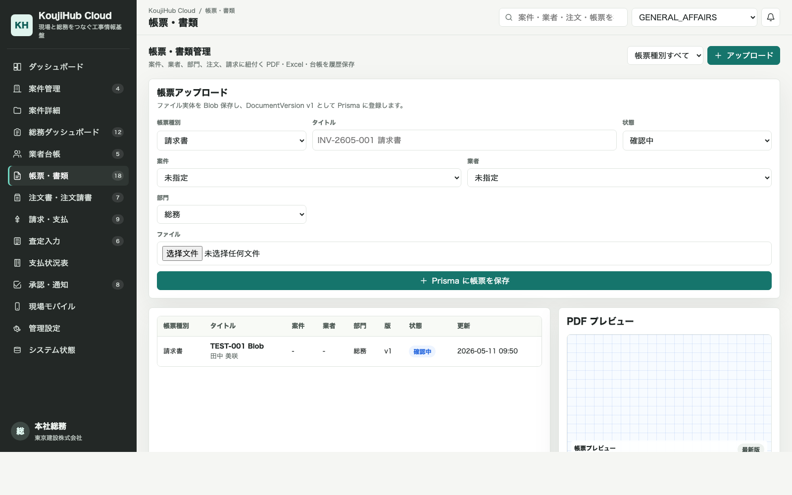
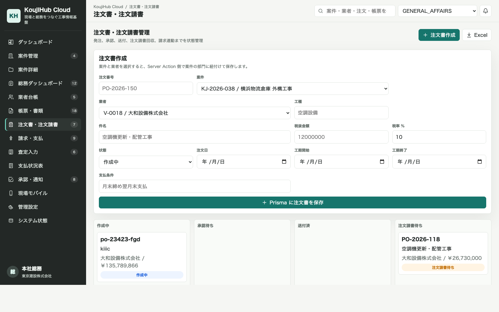
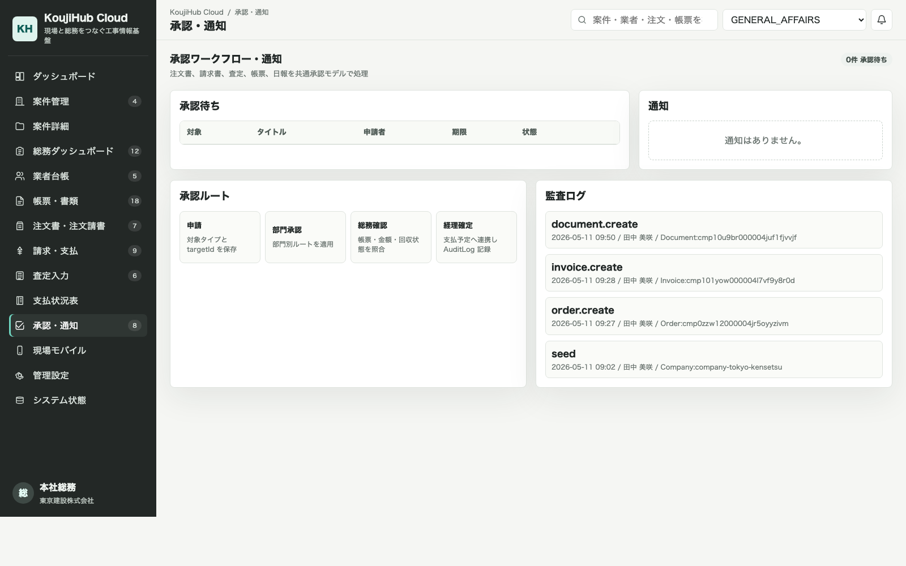
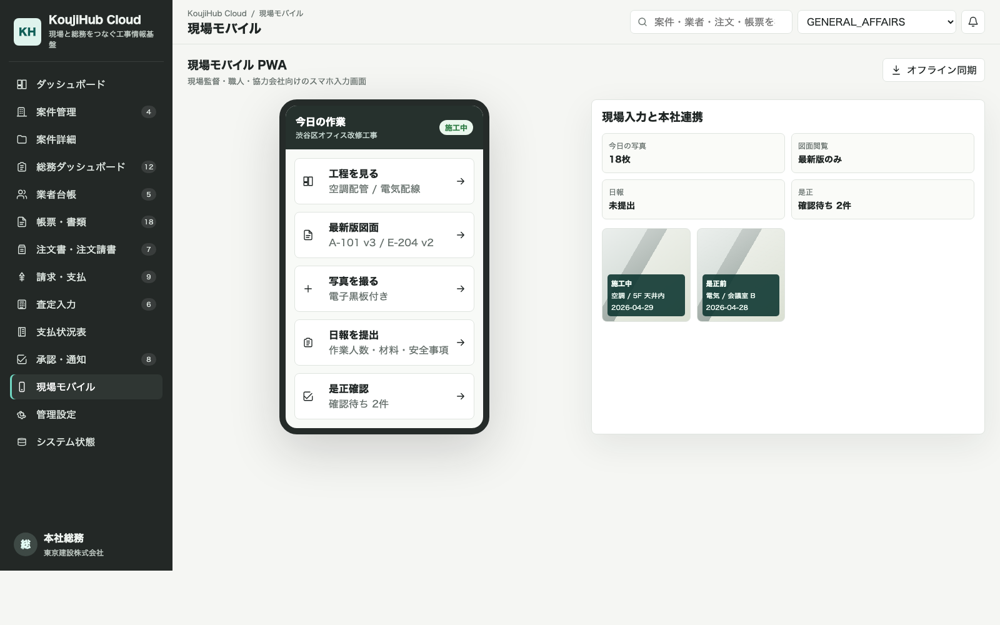
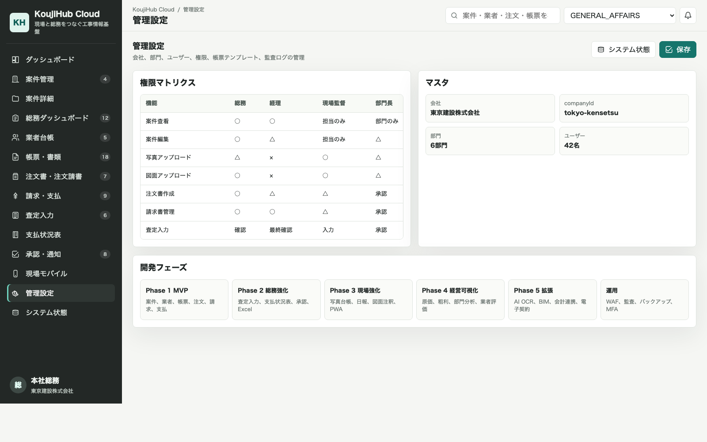
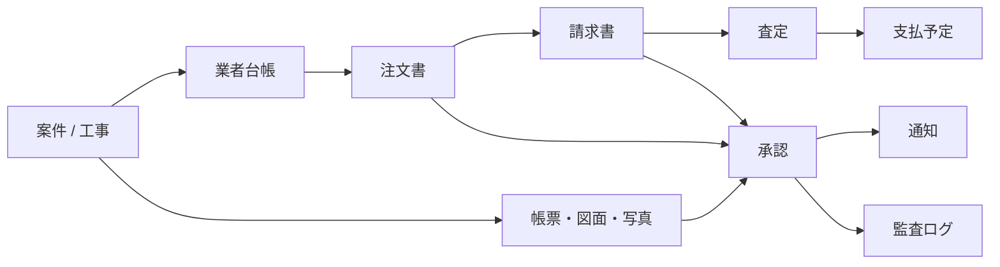
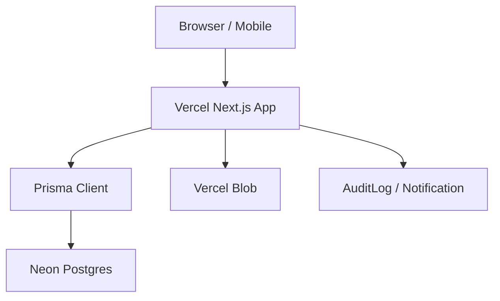

# KoujiHub Cloud

KoujiHub Cloud は、日本の建設会社向けに設計した **工事管理 + 図面・写真・工程表 + 総務部帳票・業者・支払・注文管理** 一体型クラウドシステムの MVP です。

案件 / 工事を中心に、工程表、写真、図面、日報、帳票、業者、注文書、請求、支払、査定、承認、通知、履歴を一元管理します。現場監督、協力会社、職人、本社総務、経理、管理職の間で分散しがちな情報を、検索できる・追跡できる・承認できる業務基盤として統合することを目的としています。

## コンセプト

従来、建設現場と本社総務の情報は Excel、紙資料、共有フォルダ、LINE、メール、共有ドライブに分散しやすく、注文書、請求書、写真、図面、日報、支払予定が案件単位で追いにくい状態になりがちです。

KoujiHub Cloud では、すべての業務情報を「案件 / 工事」に紐付けます。

- 現場: 工程、写真、図面、日報、是正確認を入力
- 総務: 帳票、業者、注文書、注文請書、請求、支払予定を管理
- 経理: 請求、査定、支払、インボイス、源泉控除を確認
- 管理職: 承認、差戻し、通知、監査ログを確認

## 現在の到達点

本 MVP は、ローカル mock data から正式な **Next.js + TypeScript + Prisma + PostgreSQL** 構成へ移行済みです。

- Vercel へ本番デプロイ済み
- Neon Postgres へ Prisma 経由で接続済み
- Vercel Blob による帳票ファイル保存を実装済み
- 注文書作成、請求書登録、帳票アップロードの書き込みチェーンを接続済み
- 主要操作を `AuditLog` に記録
- `/admin/system` でクラウド DB 接続状態とテーブル件数を確認可能

## 画面プレビュー

### ダッシュボード

月次締め状況、案件別ステータス、総務アラートを横断表示します。



### 総務ダッシュボード

注文請書回収、請求確認、査定入力、支払予定を総務部の作業キューとして確認します。



### 業者台帳

協力会社の取引状態、対応工種、インボイス番号、建設業許可、銀行口座を一元管理します。



### 帳票・書類管理

請求書、注文請書、安全書類などのファイルを Vercel Blob に保存し、Prisma の `Document` / `DocumentVersion` に履歴登録します。



### 注文書・注文請書

案件と業者を選択し、注文書を作成します。作成された注文書は請求書、承認、支払予定に連携します。



### 承認・通知

注文書、請求書、帳票、査定を共通承認モデルで処理し、通知と監査ログを残します。



### 現場モバイル

現場監督、職人、協力会社向けのスマホ入力画面です。工程確認、図面閲覧、写真撮影、日報提出、是正確認を想定しています。



### 管理設定

会社、部門、ユーザー、権限、帳票テンプレート、監査ログの管理画面です。



## 業務チェーン



## 実装済み機能

- ダッシュボード
- 案件管理
- 案件詳細
- 業者台帳
- 帳票・書類管理
- 注文書・注文請書管理
- 請求・支払管理
- 支払査定
- 支払状況表
- 承認ワークフロー
- 通知
- 監査ログ
- 現場モバイル画面
- 管理設定
- システム状態確認

## 実装済み Server Actions

### 案件

- `src/app/projects/actions.ts`
- 案件作成
- AuditLog 作成

### 業者

- `src/app/office/vendors/actions.ts`
- 業者作成
- デフォルト銀行口座作成
- AuditLog 作成

### 帳票

- `src/app/office/documents/actions.ts`
- 帳票メタデータ作成
- 初回ファイルバージョン作成
- 新版ファイルアップロード
- 帳票状態更新
- AuditLog 作成

### 注文書

- `src/app/office/orders/actions.ts`
- 注文書作成
- 注文書状態更新
- AuditLog 作成

### 請求書

- `src/app/office/invoices/actions.ts`
- 注文書に紐付く請求書作成
- 請求書状態更新
- AuditLog 作成

### 承認

- `src/app/approvals/actions.ts`
- 承認申請作成
- 承認
- 差戻し
- 通知既読化
- 対象レコード状態更新
- AuditLog 作成

## 技術スタック

- Next.js App Router
- TypeScript
- Prisma ORM
- PostgreSQL
- Neon Postgres
- Vercel
- Vercel Blob
- Server Components
- Server Actions

## クラウド構成



Vercel には以下の環境変数を設定します。

```text
DATABASE_URL=Neon の PostgreSQL connection string
BLOB_READ_WRITE_TOKEN=Vercel Blob の Read Write Token
```

詳しい手順は [DEPLOYMENT.md](./DEPLOYMENT.md) を参照してください。

## 帳票アップロード

`BLOB_READ_WRITE_TOKEN` が設定されている環境では、アップロードされた帳票ファイルを Vercel Blob に保存します。

ローカル開発などで Blob token が未設定の場合は、`public/uploads/documents` に保存します。

ファイルのメタデータは `DocumentVersion` に保存されます。

- `fileUrl`
- `fileName`
- `fileSize`
- `mimeType`
- `uploadedBy`
- `uploadedAt`

`public/uploads` は `.gitignore` に含まれているため、ローカル保存された実ファイルは GitHub にアップロードされません。

## システム状態確認

`/admin/system` では、以下を確認できます。

- PostgreSQL 接続状態
- 現在の `DATABASE_URL` の疎通状態
- 主要テーブルの件数
- 最近の `AuditLog`

本番環境では、Neon Postgres への接続確認と seed データの投入状況をこの画面で確認します。

## セットアップ

```bash
npm install
cp .env.example .env
```

Docker を使用する場合:

```bash
npm run db:up
npm run db:generate
npm run db:push
npm run db:seed
npm run dev
```

Docker を使用しない場合は、`.env.example` と同じ接続情報で PostgreSQL を起動してください。

- database: `koujihub`
- user: `koujihub`
- password: `koujihub`
- port: `5432`

起動後、以下で開発サーバーを開始します。

```bash
npm run dev
```

## よく使うコマンド

```bash
npm run typecheck
npm run lint
npm run build
npm run db:generate
npm run db:push
npm run db:deploy
npm run db:seed
```

## MVP スコープ

- 案件を中心にした情報一元管理
- 総務部による帳票・業者・支払管理
- 注文書と請求書の Prisma 書き込み
- 帳票ファイルアップロードとバージョン管理
- Vercel Blob によるファイル保存
- 承認申請、承認、差戻し、通知
- AuditLog による操作履歴の追跡
- `/admin/system` による DB 状態確認

## 今後の拡張候補

- 認証とロールベースアクセス制御
- 写真・図面アップロードの本実装
- 日報入力
- 支払査定の Prisma 書き込み
- Excel / PDF 帳票出力
- 会計ソフト連携
- 電子契約連携
- AI OCR による請求書・帳票読取
- WAF、監査、バックアップ、MFA などの運用強化
